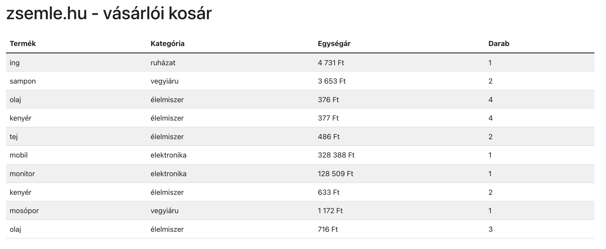
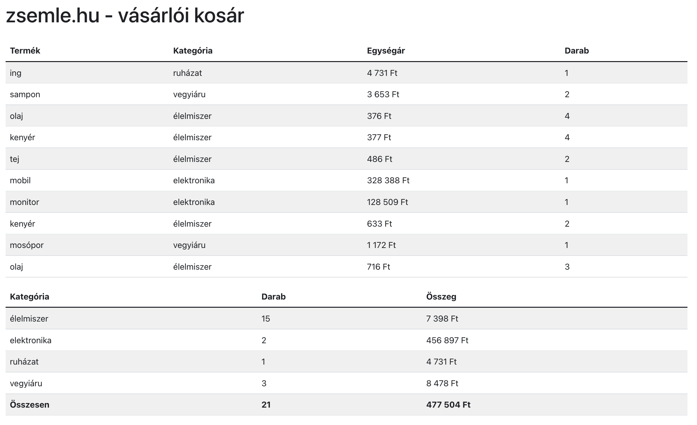
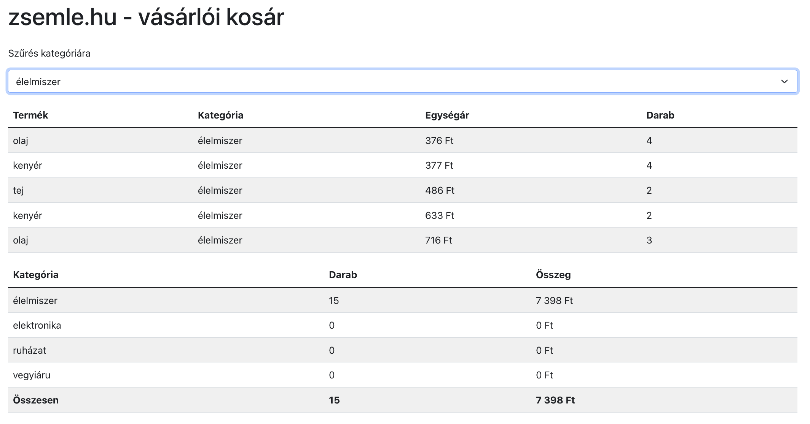
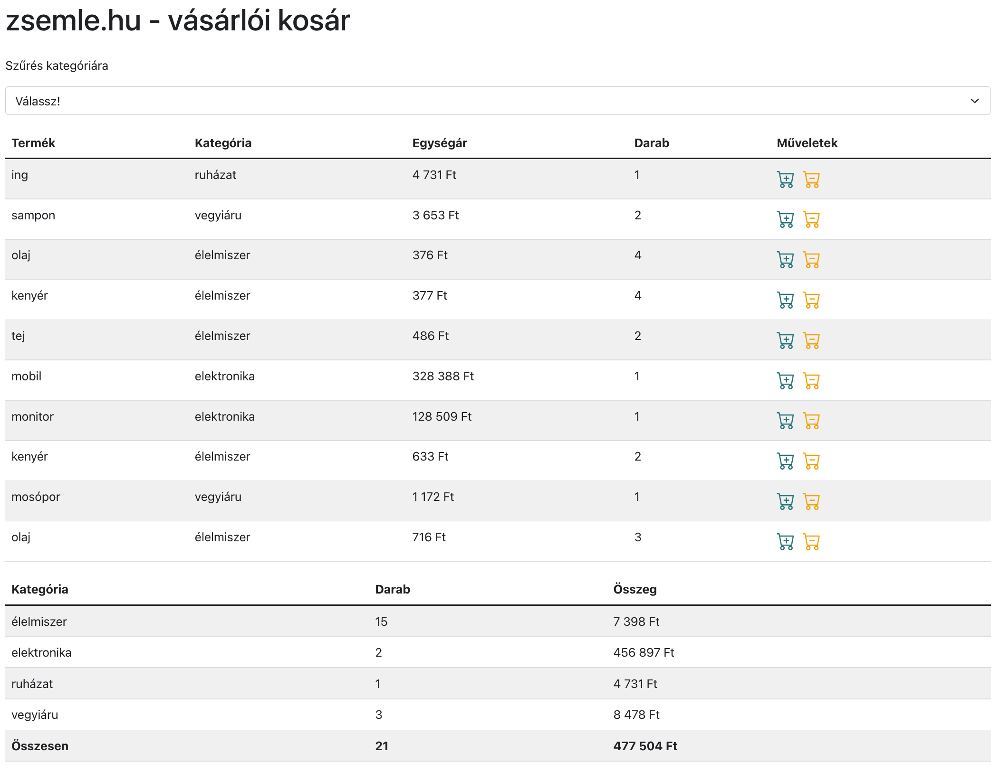
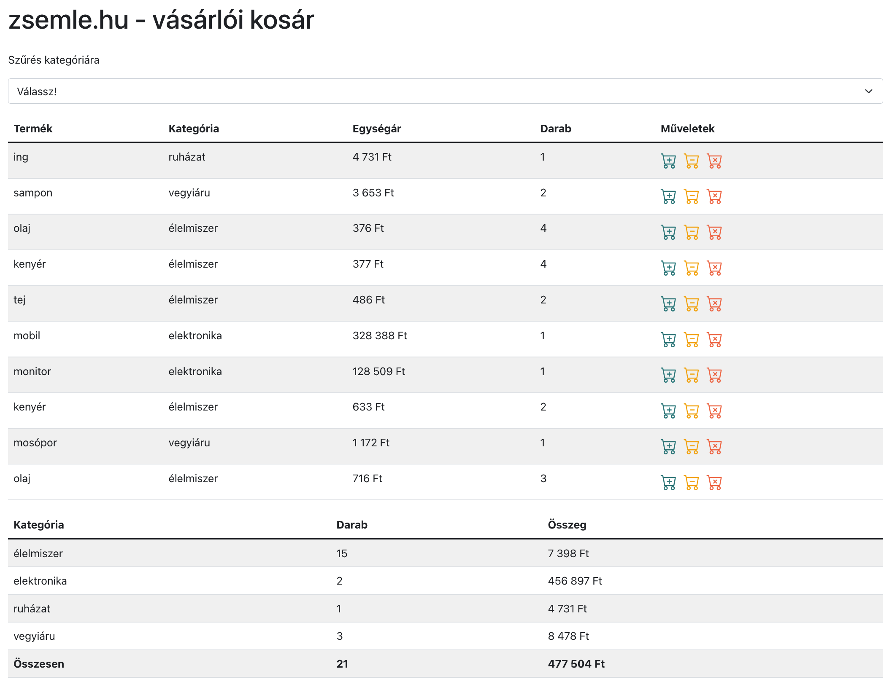
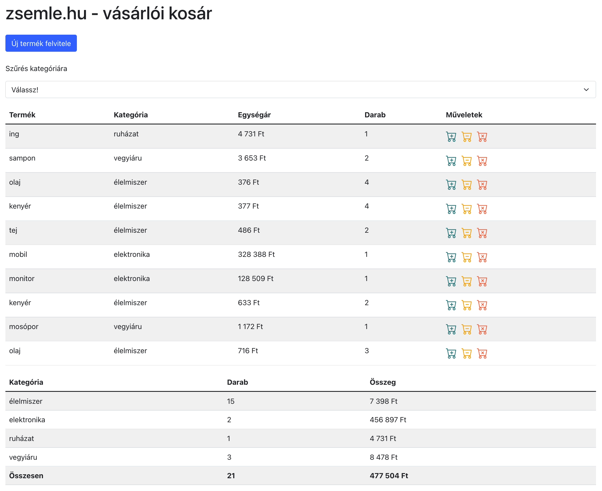
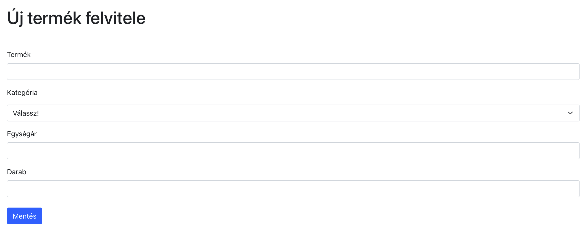
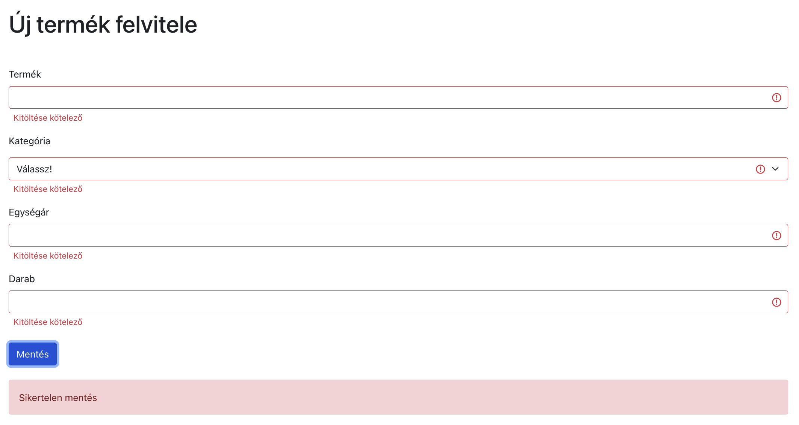
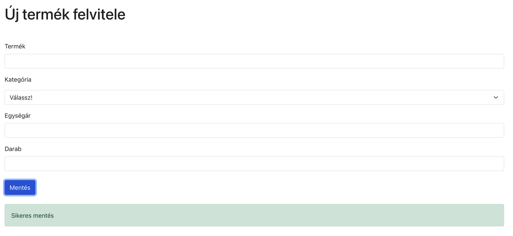

# Junior frontend fejlesztő képesítő vizsga

## Kezdeti lépések

- Fork-old ezt a repository-t a saját account-odra
- Klónozd a fork-olt repository-t a saját számítógépedre
- Commit-olj gyakran és az üzenetek legyenek elég deskriptívek
- Minden válasz és megoldás kerüljön ebbe a repository-ba

## Tartsd észben

- Bármilyen online forrást használhatsz, de **kérlek dolgozz egyedül!**
- **Ne csak copy-paste-eld** a válaszokat és megoldásokat,
  inkább használd a saját szavaidat.
- **Ne push-olj** GitHub-ra, amíg a facilitátor be nem jelenti, hogy eljött az idő
- Bármikor feltöltheted a megoldásodat
  [GradeScope-ba](https://www.gradescope.com/courses/328822/assignments/1936611) zippel tömörített formában
- A vizsga kézzel lesz pontozva (és az a végleges pontszám), az Autograder nem ad pontokat (mindenre 0-át ad).
- Az eredményednek legalább 51%-nak kell lennie, hogy sikeres legyen a vizsga
- Szükség esetén bővítsd a `.gitignore` fájl(oka)t, hogy GitHubra ne kerüljön olyan dokumentum, aminek nincs ott a helye

# Zsemle.hu webshop vásárlói kosara

Egy webshop vásárlói kosarának felületét fejlesztjük tovább.

## Általános követelmények

- A kiindulókódban megtalálható a vásárló kosár aktuális állapotának táblázata, ezt kell kiegészíteni 5 új funkcióval és hatodik feladatként hosztolni a Firebase szolgáltatónál.
- Az adatkezeléshez a Firestore online NoSQL adatbáziskezelőt kell használni.
- Megjelenésben a Bootstrap 5 CSS keretrendszer használandó SCSS stílussal
- Használható npm packagek: bootstrap, bootstrap-icons, firebase, react, react-dom, react-router-dom, react-scripts, node-sass, sass, validator, web-vitals

## Adatbázis beállítása

Adatbázishoz használj Firestore-t:

- Engedélyezd az `anonymous` beléptetést az `Authentication` menüpont alatt.
- Hozz létre egy adatbázist Firestore alatt
- A `zsemle/src/firebase/config.example.js` file alapján készíts
  ugyanabban a könyvtárban egy `config.js`
  file-t, a projektedhez tartozó beállításokat használd.
- Készíts egy `zsemle` collectiont Firestore-ban
- Állítsd be Firestore-ban az írási és olvasási engedélyt/szabályt
- (Opcionális) példa adatok feltöltéséhez futtasd a `zsemle`
  könyvtárban állva a `yarn loadData` vagy `npm run loadData` utasítást.

## Kiinduló állapot

## Feladatsor főbb pontjai

1. feladat: Statisztika táblázat készítése (20 pont)
1. feladat: Szűrés kategóriára (15 pont)
1. feladat: Termék darabszámának módosítása (15 pont)
1. feladat: Termék törlése (15 pont)
1. feladat: Új termék felvitele (20 pont)
1. feladat: Weboldal hosztolása (15 pont)

## 1. feladat: Statisztika táblázat készítése

- A táblázat alatt szerepeljen egy statisztika táblázatban,
  hogy kategóriánként összesen hány darab termék, milyen összeggel található a vásárlói kosarunkban
- az első oszlop a kor kategóriákat tartalmazza (`src/utils.js` `products` objektumának értékei)
- a második oszlop az adott kategóriába tartozó termékek darabszámainak összegét mutassa. Például ha az 'élelmiszer' kategóriában van 2 tej és 1 kenyér, akkor 3 legyen a darabszám.
- a harmadik oszlop az adott kategóriába tartozó termékek összértékét mutassa. Például ha az 'élelmiszer' kategóriában van:
  - 2 tej 100 Ft-os egységáron
  - 1 kenyér 300 Ft-os egységáron
    akkor az összeg (2 x 100 Ft + 1 x 300 Ft) 500 Ft legyen.
- az utolsó sorban legyen az összegzés (összes darabszám, összes összeg)
- az adatok kiszámolásához JavaScript kódot használj (ne adatbázis aggregáló
  függvényt)
- ehhez hasonlóan:

## 2. feladat: Szűrés kategóriára

Egy legördülő lista alapján szűrd le és frissítsd az adott táblázat tartalmát

- Készíts egy legördülő selectet "Szűrés kategóriára" címkével.
- A `<select>` értékkészlete megtalálható az `src/utils.js` fájl `categories` objektumában. A listában lévő kategóriák mellett legyen egy "Válassz!" opció is.
- A "Válassz!" opció legyen alapértelmezetten kiválasztva és ebben az esetben az összes adatot mutassa
- Firebase-ből a kiválasztott opciónak megfelelően legyenek az adatok lekérve
- A táblázat értékei a `<select>`-ben kiválasztott értéknek megfelelően mutassa az adatokat a Firestore adatbázisból
- Használj Bootstrap osztályokat

## 3. feladat: Termék darabszámának módosítása

- Hozz létre a táblázatban egy új oszlopot 'Műveletek' fejléccel
- A táblázat minden sorába kerüljön a 'Műveletek' oszlopba
  - egy `increment-{id}` azonosítót (`{id}` helyére az adott termék `id`-ja kerüljön) és `bi-cart-plus` Bootstrap osztált használó ikon (`<i>`), melynek hozzáadás lesz a funckiója
  - egy `decrement-{id}` azonosítót (`{id}` helyére az adott termék `id`-ja kerüljön) és `bi-cart-dash` Bootstrap osztályt használó ikon (`<i>`), melynek elvétel lesz a funkciója
- Az ikonokat tedd kattinthatóvá
- A 'hozzáadás' ikonra kattintva nőjön eggyel az adott sorban található termék darabszáma
- Az 'elvétel' ikonra kattintva csökkenjen eggyel az adott sorban található termék darabszáma
- A termékek darabszáma nem csökkenhet 0 alá
- Egy termék 0 darabszámmal is létezhet a kosárban (azaz nem törlődik automatikusan)
- A termékek darabszámváltozása frissüljön a Firebase adatbázisban is (`count` mező)

## 4. feladat: Törlés funkció

- A 'Műveletek' oszlop minden sorába kerüljön egy `delete-{id}` azonosítót (`{id}` helyére az adott termék `id`-ja kerüljön) és `bi-cart-x` Bootstrap osztályt használó ikon (`<i>`)
- Ezen 'törlés' ikon megnyomására a gombhoz tartozó dokumentum legyen törölve az adatbázisból
- A törlés ikon megnyomására a gombhoz tartozó sor legyen törölve a táblázatból

## 5. feladat: Új termék hozzáadása

- Legyen egy "Új termék felvitele" gomb a főoldali táblázat felett
- Az "Új termék felvitele" gomb a `/products/add` oldalra navigáljon oldalújratöltés nélkül
- Az űrlap tetején jelenjen meg a következő 1-es címsorba tartozó felirat: "Új termék felvitele"
- Legyen egy űrlap a következő beviteli mezőkkel, és hozzájuk tartozó `<label>`
  elemmel:
  - 'Termék neve', `text` típus, `name` legyen az azonosítója
  - 'Kategória', `<select>` típusú, `category` legyen az azonosítója, választható értékei:
    "Válassz!", plussz az `src/utils.js` fájlban található `categories` objektum értékei.
  - 'Egységár', `number` típusú, `price` legyen az azonosítója
  - 'Darab', `number` típusú legyen, és `count` legyen az azonosítója
  - 'Mentés' gomb, amit megnyomva felviszi a versenyzőt

### "Új termék felvitele" gomb a főoldalon:

### /products/add aloldal:

- Az űrlap mezőire alkalmazzuk az alább definiált validációs szabályokat. Validálnunk a 'Mentés' gomb megnyomásakor szükséges. Validációs hibák esetén minden hibás beviteli mező alatt jelenjen meg a hozzá tartozó hibaüzenet. Egy mezőhöz elég egy hibaüzenetet megjelenítenünk (amelyik az alábbi listában fentebb lett definiálva)
- 'Termék neve' validációs szabályok lefejlesztése és alkalmazása:
  - Kötelezően kitöltendő, hibaüzenet: 'Kitöltése kötelező'
  - Legalább 2 karakter hosszú legyen. Hibaüzenet: 'Leglább 2 karakter hosszú legyen'
- 'Kategória' validációs szabályok lefejlesztése és alkalmazása:
  - Kötelezően kitöltendő (a Válassz! opció nem maradhat), hibaüzenet: 'Kitöltése kötelező'
- 'Egységár' validációs szabályok lefejlesztése és alkalmazása:
  - Kötelezően kitöltendő, hibaüzenet: 'Kitöltése kötelező'
  - Nem lehet negatív, hibaüzenet: 'Nem lehet negatív'
- 'Darab' validációs szabályok lefejlesztése és alkalmazása:
  - Kötelezően kitöltendő, hibaüzenet: 'Kitöltése kötelező'
  - Értéke 1 és 10 között lehet, hibaüzenet: '1 és 10 közötti érték legyen'
- Ha a form valid, akkor mentés gomb megnyomására menti Firestore adatbázisba az adatokat.
- Sikeres mentés esetén Bootstrap sikeres (`success`) alert üzenet megjelenítése a form
  alatt: 'Sikeres mentés'
- Sikertelen mentés (bármilyen validációs hiba) esetén Bootstrap `danger` alert üzenet megjelenítése a form alatt: 'Sikertelen mentés'
- Sikeres mentés esetén a form mezői legyenek kiürítve

### Mentés hibás adatokkal:

### Mentés helyes adatokkal:

## 6. feladat: Weboldal hosztolása

- Buildeld le a munkádat
- Deployold Firebase hosting szolgáltatónál
- A repositoryban található [zsemle/public-link.txt](public-link.txt)
  fájlba írd bele a hosting linkjét, pl.: http://valami-nev-23231dd9.web.app
