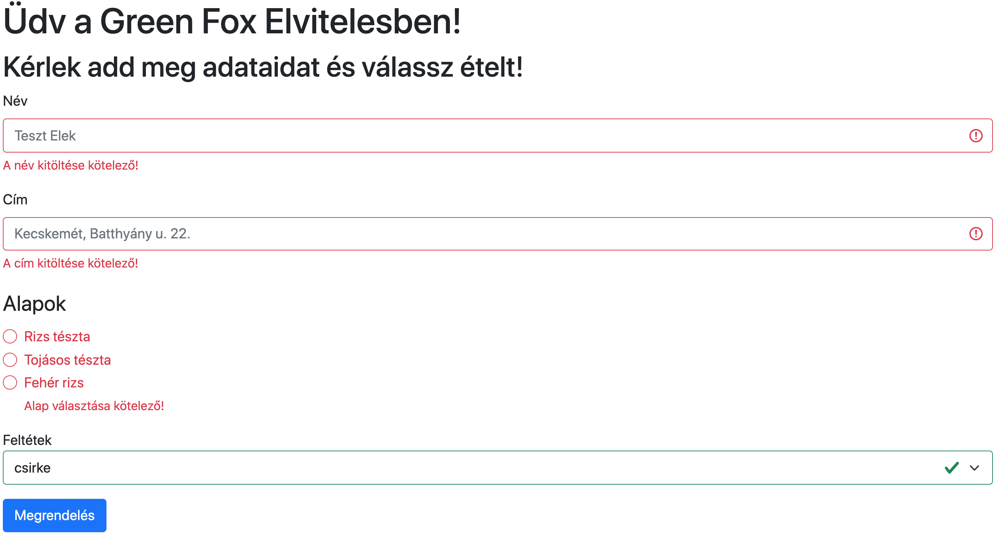

# HSG JS 3. részidős vizsga

## Kezdeti lépések

- Fork-old ezt a repository-t a saját account-odra
- Klónozd a fork-olt repository-t a saját accountod alól a saját számítógépedre
- Commit-olj gyakran és az üzenetek legyenek elég deskriptívek
- Minden válasz és megoldás kerüljön ebbe a repository-ba

## Tartsd észben

- Bármilyen online forrást használhatsz, de **kérlek dolgozz egyedül!**

- **Ne csak copy-paste-eld** a válaszokat és megoldásokat,
  inkább használd a saját szavaidat, értened kell, amit használsz. 

- **Ne push-olj** GitHub-ra, amíg a mentorod be nem jelenti, hogy eljött az idő

### GradeScope

- A vizsgát [GradeScope-on](https://www.gradescope.com/courses/328822/assignments/1761453) *zippel* tömörített formában
  kell leadnod.

- Az utolsó fél órától ajánljuk a projekted feltöltését a
  [GradeScope-ba](https://www.gradescope.com/courses/328822/assignments/1761453) *zippel* tömörített formában.

- GradeScope-ra a `frontend/public` mappa tartalma legyen feltöltve. A `node_modules` mappa tartalma nem kerülhet
  bele a tömörített fájlba (hibát okozhat feltöltéskor).

- A GradeScope pontozása nem végleges, csak tájékoztató jellegű. Minden megoldást kézzel is ellenőrzünk. 

## Feladatok

# Green Fox Takeout :ramen:

Ebben a projektben megírjuk a saját online elviteles éttermünket,
ahol a vendégek a saját preferenciáik alapján rendelhetnek ételt. :stew:

**Kérlek olvasd el a teljes leírást egymás után, hogy jobban megértsd az alkalmazást**

A megoldás a `frontend/public` mappába kerüljön.

## Főoldal (`index.html`)

- A főoldalt ki kell renderelni (látszódnia kell a böngészőben)

- Ahol lehet, használd a **Bootstrap 5** által adott lehetőségeket.

- A főoldalnak tartalmaznia kell egy formot (űrlapot),
  aminek a következő tulajdonságai vannak:
  
  - 2 input mezője "címkével" (label) ellátva
  - Egy radio választónak
  - Egy lenyíló (drop-down) listának

  

- Az alapok opciói legyenek:
  - `Rizs tészta` (value = `rice noodles`),
  - `Tojásos tészta` (value = `egg noodles`) és
  - `Fehér rizs` (value = `white rice`)

- A feltétek opciói legyenek:
  - `csirke` (value = `chicken`), ez az alapállapot,
  - `marha` (value = `beef`) és
  - `füstölt tofu` (value = `smoked tofu`)

- A vevő egyszerre mindegyikből csak egyet választhat

- Az űrlap tartalma a következő endpointra legyen elküldve aszinkron lekérést használva: `POST /api/orders`

- A backend dokumentációja lejjebb olvasható

- Sikeres megrendelés esetén: 
  - írja ki a form alá Bootstrap alertet használva:
    `Sikeres megrendelés. A rendelés azonosítója {orderId}`. 
  - Az `{orderId}` helyére legyen beírva az új rendelés azonosítója
  - állítsa alapállapotba a formot (üresítse ki).

- Az űrlapon minden mező kitöltése kötelező. A validációt Bootstrap-pel valósítsd meg, ahogyan az alábbi képen is látható.
  - Az űrlap üresen hagyott mező esetén a képen látható hibaüzeneteket jelenítse meg

  

## Backend dokumentáció

### Elindítás

- A backend kódja a `backend` mappában található
- A `backend` könyvtárba lépve az `npm install` paranccsal lehet a csomagokat telepíteni
  (ennek futtatása akár több percet is igénybe vehet)
- és az `npm start` parancs hatására a `http://localhost:5000` hoston szolgáltatja a backendet.

### `POST /api/orders`

Az űrlap tartalmát ez az endpoint fogadja. Ezzel lehet rendelést felvinni.

#### Request format 
```json 
{
  "name": "Péter Szél",
  "address": "Andrássy út 11.",
  "base": "white rice",
  "topping": "chicken"
}
```

#### Response format

```json 
{
  "_id": "GxqazjOnDLivCvQE",
  "name": "Péter Szél",
  "address": "Andrássy út 11.",
  "base": "white rice",
  "topping": "chicken",
  "status": "ordered"
}
```
